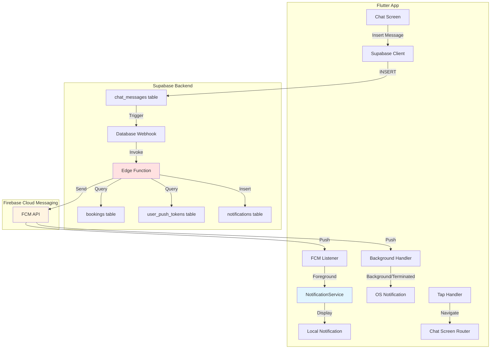

# Design Document: Chat Push Notifications

## Overview

This design specifies the technical implementation for completing the chat push notification feature in a Flutter application with Supabase backend and Firebase Cloud Messaging (FCM) integration. The system enables real-time push notifications when chat messages are sent, supporting foreground, background, and terminated app states.

### Current State

The application has partial implementation:
- FCM SDK integrated with token collection via `upsertMyPushToken`
- Database tables: `chat_messages`, `chat_threads`, `user_push_tokens`
- Supabase Edge Function: `chat_push_new_message` (complete implementation)
- Basic foreground message listener (logs only, no UI notification)
- Permission handling for FCM

### Missing Components

1. **Foreground local notifications**: No visual notification displayed when app is open
2. **Database webhook**: Edge Function not triggered automatically on message insert
3. **Notification tap handling**: No navigation logic for notification interactions
4. **Android notification channel**: Not configured for proper heads-up display
5. **Token cleanup**: No logout handler to remove stale tokens
6. **Token refresh**: No listener for FCM token updates

### Design Goals

- Display local notifications in foreground state using `flutter_local_notifications`
- Configure database webhook to trigger Edge Function on message insert
- Implement comprehensive notification tap handling for all app states
- Set up Android notification channel with HIGH importance for heads-up display
- Add token lifecycle management (refresh, cleanup on logout)
- Maintain security through proper validation and error handling

## Architecture

### System Components



### Message Flow

**Foreground State:**
1. User A sends message → Supabase inserts into `chat_messages`
2. Database webhook triggers Edge Function
3. Edge Function sends FCM message to User B's tokens
4. FCM delivers to User B's device (app open)
5. `FirebaseMessaging.onMessage` listener receives message
6. NotificationService displays local notification with heads-up style
7. User B taps notification → Navigate to chat screen

**Background/Terminated State:**
1. User A sends message → Supabase inserts into `chat_messages`
2. Database webhook triggers Edge Function
3. Edge Function sends FCM message to User B's tokens
4. FCM delivers to User B's device (app closed/background)
5. OS displays system notification
6. User B taps notification → App launches/resumes
7. `FirebaseMessaging.onMessageOpenedApp` or `getInitialMessage` extracts data
8. App navigates to chat screen with booking_id

### State Management

The notification system operates across three distinct app states:

| State | Handler | Display Method | Tap Handler |
|-------|---------|----------------|-------------|
| Foreground | `FirebaseMessaging.onMessage` | `flutter_local_notifications` | `onDidReceiveNotificationResponse` |
| Background | OS (FCM) | System notification | `FirebaseMessaging.onMessageOpenedApp` |
| Terminated | OS (FCM) | System notification | `FirebaseMessaging.getInitialMessage` |

## Components and Interfaces

### 1. NotificationService (Flutter)

**Location:** `lib/core/services/notification_service.dart`

**Responsibilities:**
- Initialize `flutter_local_notifications` plugin
- Create Android notification channel
- Display local notifications in foreground
- Handle notification tap events
- Manage FCM token lifecycle

**Key Methods:**

```dart
class NotificationService {
  final FlutterLocalNotificationsPlugin _localNotifications;
  final FirebaseMessaging _messaging;
  final Function(String bookingId) onNotificationTap;
  
  /// Initialize notification service and create Android channel
  Future<void> initialize();
  
  /// Display local notification for foreground messages
  Future<void> showChatNotification({
    required String title,
    required String body,
    required String bookingId,
  });
  
  /// Set up FCM listeners for all app states
  void setupFcmListeners();
  
  /// Handle notification tap from local notifications
  void _onNotificationTapped(NotificationResponse response);
  
  /// Set up token refresh listener
  void setupTokenRefreshListener(SupabaseDataSource dataSource);
}
```

**Android Notification Channel Configuration:**

```dart
const AndroidNotificationChannel channel = AndroidNotificationChannel(
  'chat',                          // id
  'Chat Messages',                 // name
  description: 'Notifications for new chat messages',
  importance: Importance.high,     // Enables heads-up
  playSound: true,
  sound: RawResourceAndroidNotificationSound('notification'),
);
```

### 2. Database Webhook Configuration

**Trigger:** INSERT on `public.chat_messages`

**Configuration SQL:**

```sql
-- Create webhook to invoke Edge Function on message insert
-- Run in Supabase SQL Editor or via Supabase Dashboard

-- Note: Supabase webhooks are configured via Dashboard:
-- Database → Webhooks → Create a new hook
-- 
-- Settings:
--   Name: chat_message_push_notification
--   Table: public.chat_messages
--   Events: INSERT
--   Type: Edge Function
--   Edge Function: chat_push_new_message
--   HTTP Headers: (none required)
```

**Webhook Payload Structure:**

```typescript
{
  type: "INSERT",
  table: "chat_messages",
  schema: "public",
  record: {
    id: "uuid",
    thread_id: "uuid",
    booking_id: "uuid",
    sender_id: "uuid",
    body: "message text",
    created_at: "timestamp"
  },
  old_record: null
}
```

### 3. Edge Function Enhancement

**Current Implementation:** The Edge Function at `supabase/functions/chat_push_new_message/index.ts` is complete and handles:
- Recipient identification (customer vs professional)
- In-app notification insertion
- FCM push delivery to all recipient tokens
- Error handling and logging

**No changes required** - the existing implementation satisfies all requirements.

**Error Handling Strategy:**
- Returns 400 for missing `booking_id` or `sender_id`
- Returns 500 for database query failures
- Returns 200 with `pushed: 0` when no tokens exist
- Continues delivery to remaining tokens if one fails
- Logs all errors for debugging

### 4. Navigation Handler

**Location:** `lib/main.dart` or dedicated router file

**Responsibilities:**
- Extract `booking_id` from notification data
- Navigate to chat screen
- Handle invalid booking_id gracefully

**Implementation Pattern:**

```dart
void handleNotificationNavigation(Map<String, dynamic> data) {
  final bookingId = data['booking_id'] as String?;
  final type = data['type'] as String?;
  
  if (bookingId == null || bookingId.isEmpty) {
    debugPrint('[Notification] Invalid booking_id in notification data');
    return;
  }
  
  if (type != 'chat_message') {
    debugPrint('[Notification] Unknown notification type: $type');
    return;
  }
  
  // Navigate to chat screen
  // Implementation depends on app's navigation pattern (Navigator 2.0, GoRouter, etc.)
  navigatorKey.currentState?.pushNamed(
    '/chat',
    arguments: {'bookingId': bookingId},
  );
}
```

### 5. Token Lifecycle Management

**Token Refresh:**

```dart
// Listen for token refresh events
FirebaseMessaging.instance.onTokenRefresh.listen((newToken) async {
  final platform = Platform.isIOS ? 'ios' : Platform.isAndroid ? 'android' : 'web';
  await supabaseDataSource.upsertMyPushToken(
    platform: platform,
    token: newToken,
  );
});
```

**Token Cleanup on Logout:**

```dart
Future<void> logout() async {
  // Get current FCM token
  final token = await FirebaseMessaging.instance.getToken();
  
  if (token != null && token.isNotEmpty) {
    // Delete from database
    await supabase
      .from('user_push_tokens')
      .delete()
      .eq('token', token);
  }
  
  // Proceed with normal logout
  await supabase.auth.signOut();
}
```

## Data Models

### FCM Message Payload

**Notification Field:**
```json
{
  "title": "New message",
  "body": "Message preview truncated to 140 chars..."
}
```

**Data Field:**
```json
{
  "booking_id": "uuid-string",
  "type": "chat_message"
}
```

**Android-Specific:**
```json
{
  "android": {
    "priority": "high",
    "notification": {
      "channel_id": "chat",
      "sound": "default"
    }
  }
}
```

**iOS-Specific:**
```json
{
  "apns": {
    "payload": {
      "aps": {
        "sound": "default"
      }
    }
  }
}
```

### Local Notification Data

**Android Notification Details:**
```dart
AndroidNotificationDetails(
  'chat',                           // channel id
  'Chat Messages',                  // channel name
  channelDescription: 'Notifications for new chat messages',
  importance: Importance.high,
  priority: Priority.high,
  showWhen: true,
  sound: RawResourceAndroidNotificationSound('notification'),
)
```

**iOS Notification Details:**
```dart
DarwinNotificationDetails(
  presentAlert: true,
  presentBadge: true,
  presentSound: true,
  sound: 'notification.aiff',
)
```

**Notification Payload:**
```dart
NotificationDetails(
  android: androidDetails,
  iOS: iosDetails,
)
```

### Database Schema Reference

**user_push_tokens:**
```sql
CREATE TABLE user_push_tokens (
  id UUID PRIMARY KEY DEFAULT gen_random_uuid(),
  user_id UUID NOT NULL REFERENCES users(id) ON DELETE CASCADE,
  platform TEXT NOT NULL CHECK (platform IN ('android','ios','web')),
  token TEXT NOT NULL,
  created_at TIMESTAMPTZ NOT NULL DEFAULT now(),
  UNIQUE (user_id, token)
);
```

**chat_messages:**
```sql
CREATE TABLE chat_messages (
  id UUID PRIMARY KEY DEFAULT gen_random_uuid(),
  thread_id UUID NOT NULL REFERENCES chat_threads(id) ON DELETE CASCADE,
  booking_id UUID NOT NULL REFERENCES bookings(id) ON DELETE CASCADE,
  sender_id UUID NOT NULL REFERENCES users(id) ON DELETE CASCADE,
  body TEXT NOT NULL,
  created_at TIMESTAMPTZ NOT NULL DEFAULT now()
);
```


## Correctness Properties

*A property is a characteristic or behavior that should hold true across all valid executions of a system—essentially, a formal statement about what the system should do. Properties serve as the bridge between human-readable specifications and machine-verifiable correctness guarantees.*

### Property Reflection

After analyzing all acceptance criteria, I identified the following redundancies:
- Properties 1.4 and 10.2 both test message truncation to 140 characters → Combined into Property 1
- Properties 1.3, 2.7, and 5.4 all test navigation to chat screen → Combined into Property 2
- Properties 5.1, 5.2, and 5.3 all test booking_id extraction across app states → Combined into Property 3
- Properties 1.5 and 10.5 both test notification data payload structure → Combined into Property 4
- Property 2.5 is subsumed by Properties 1 and 4 (truncation + payload structure) → Removed

### Property 1: Message Truncation

*For any* chat message body, when creating a notification (local or FCM), if the message exceeds 140 characters, the notification body SHALL be exactly the first 140 characters followed by an ellipsis (…); otherwise, the notification body SHALL be the complete message text.

**Validates: Requirements 1.4, 10.2, 10.3**

### Property 2: Notification Tap Navigation

*For any* notification tap event (foreground local notification, background system notification, or terminated state notification), if the notification data contains a valid booking_id, the app SHALL navigate to the chat screen with that booking_id as a parameter.

**Validates: Requirements 1.3, 2.7, 5.4**

### Property 3: Booking ID Extraction

*For any* notification received in any app state (foreground, background, or terminated), the notification handler SHALL successfully extract the booking_id from the notification data payload.

**Validates: Requirements 5.1, 5.2, 5.3**

### Property 4: Notification Payload Structure

*For any* notification created for a chat message, the notification data payload SHALL contain both a "booking_id" field with the message's booking_id value and a "type" field with the value "chat_message".

**Validates: Requirements 1.5, 10.5**

### Property 5: Notification Title Consistency

*For any* chat notification created (local or FCM), the notification title SHALL be exactly "New message".

**Validates: Requirements 10.1**

### Property 6: Recipient Identification

*For any* chat message with a sender_id and booking_id, the Edge Function SHALL identify the recipient as the booking participant who is NOT the sender (if sender is customer, recipient is professional's user_id; if sender is professional's user_id, recipient is customer).

**Validates: Requirements 2.2**

### Property 7: Token Retrieval Completeness

*For any* recipient user_id, the Edge Function SHALL retrieve ALL push tokens associated with that user_id from the user_push_tokens table.

**Validates: Requirements 2.3**

### Property 8: FCM Delivery to All Tokens

*For any* set of push tokens retrieved for a recipient, the Edge Function SHALL attempt to send an FCM message to EACH token in the set.

**Validates: Requirements 2.4**

### Property 9: Input Validation

*For any* webhook payload received by the Edge Function, if either booking_id or sender_id is missing or empty, the function SHALL reject the request and return a 400 status code.

**Validates: Requirements 4.2**

### Property 10: Error Resilience in Token Delivery

*For any* set of push tokens where FCM delivery fails for one or more tokens, the Edge Function SHALL continue attempting delivery to all remaining tokens in the set.

**Validates: Requirements 4.6**

### Property 11: Token Cleanup on Logout

*For any* user logout action, if the device has a current FCM token, the app SHALL delete that token from the user_push_tokens table before completing the logout.

**Validates: Requirements 8.3**

### Property 12: Token Refresh Handling

*For any* FCM token refresh event, the app SHALL call upsertMyPushToken with the new token value to update the database.

**Validates: Requirements 8.4**

### Property 13: Foreground Notification Display

*For any* chat message received while the app is in foreground state, the NotificationService SHALL display a local notification containing the message preview.

**Validates: Requirements 1.1**

## Error Handling

### Flutter App Error Scenarios

**1. Invalid Booking ID in Notification Data**
- **Detection:** booking_id is null, empty, or not a valid UUID
- **Response:** Log error, display toast message "Unable to open chat", navigate to home screen
- **Code Location:** Navigation handler in NotificationService

**2. FCM Token Retrieval Failure**
- **Detection:** `FirebaseMessaging.instance.getToken()` returns null or throws exception
- **Response:** Log error, continue app initialization without push notifications
- **Code Location:** FCM initialization in main.dart

**3. Local Notification Display Failure**
- **Detection:** `FlutterLocalNotificationsPlugin.show()` throws exception
- **Response:** Log error, continue normal operation (user misses notification but app remains functional)
- **Code Location:** NotificationService.showChatNotification()

**4. Token Upsert Failure**
- **Detection:** Supabase upsertMyPushToken throws exception (network error, auth error)
- **Response:** Log error, retry on next app launch (token will be re-upserted)
- **Code Location:** FCM initialization and token refresh listener

**5. Notification Permission Denied**
- **Detection:** `requestPermission()` returns denied status
- **Response:** Log warning, continue without notifications, optionally show in-app prompt to enable
- **Code Location:** FCM initialization

### Edge Function Error Scenarios

**1. Missing Required Fields (400 Error)**
- **Detection:** booking_id or sender_id missing from webhook payload
- **Response:** Return `{ ok: false, error: "missing booking_id or sender_id" }` with status 400
- **Logging:** Error message with payload details
- **Code Location:** Input validation at function start

**2. Booking Lookup Failure (500 Error)**
- **Detection:** Supabase query for booking returns error or null
- **Response:** Return `{ ok: false, error: "booking lookup failed: <details>" }` with status 500
- **Logging:** Error message with booking_id
- **Code Location:** Booking query section

**3. Professional Lookup Failure (500 Error)**
- **Detection:** Supabase query for professional returns error
- **Response:** Return `{ ok: false, error: "professional lookup failed: <details>" }` with status 500
- **Logging:** Error message with professional_id
- **Code Location:** Professional query section

**4. No Recipient (200 Success)**
- **Detection:** No professional assigned to booking yet
- **Response:** Return `{ ok: true, skipped: "no recipient" }` with status 200
- **Logging:** Info message
- **Code Location:** After recipient identification

**5. No Push Tokens (200 Success)**
- **Detection:** Token query returns empty array
- **Response:** Return `{ ok: true, pushed: 0 }` with status 200
- **Logging:** Info message with recipient_id
- **Code Location:** After token retrieval

**6. FCM Token Delivery Failure (Partial Success)**
- **Detection:** FCM API returns error for specific token (invalid token, expired, etc.)
- **Response:** Log error with token identifier, continue to next token, return success with count of successful deliveries
- **Logging:** Error message with token and FCM error details
- **Code Location:** Token delivery loop

**7. Google OAuth Token Failure (500 Error)**
- **Detection:** OAuth token request fails
- **Response:** Return `{ ok: false, error: "oauth token error: <details>" }` with status 500
- **Logging:** Error message with HTTP status and response
- **Code Location:** getGoogleAccessToken function

**8. FCM API Failure (500 Error)**
- **Detection:** FCM send request returns non-200 status
- **Response:** Throw error (caught by main handler), return 500
- **Logging:** Error message with FCM response
- **Code Location:** sendFcm function

### Error Recovery Strategies

**Automatic Retry:**
- Database webhook has built-in retry for Edge Function failures (Supabase default: 3 retries with exponential backoff)
- FCM token refresh automatically triggers upsert on next refresh event

**Manual Recovery:**
- Stale tokens: Periodic cleanup job (recommended weekly) to remove tokens older than 90 days
- Failed notifications: Users can pull-to-refresh chat screen to see new messages

**Graceful Degradation:**
- If push notifications fail, users still receive in-app notifications via Realtime subscription
- If local notifications fail in foreground, users still see messages in chat screen if open

## Testing Strategy

### Dual Testing Approach

This feature requires both unit tests and property-based tests for comprehensive coverage:

**Unit Tests:** Verify specific examples, edge cases, and error conditions
- Specific notification payload examples
- Error handling scenarios (missing fields, invalid IDs)
- Android notification channel configuration
- Token cleanup on logout

**Property-Based Tests:** Verify universal properties across all inputs
- Message truncation for any message length
- Navigation for any valid booking_id
- Payload structure for any message
- Recipient identification for any sender/booking combination

### Property-Based Testing Configuration

**Framework:** Use `faker` package for Dart/Flutter to generate random test data

**Configuration:**
- Minimum 100 iterations per property test
- Each test tagged with: `Feature: chat-push-notifications, Property {number}: {property_text}`

**Example Property Test Structure:**

```dart
import 'package:test/test.dart';
import 'package:faker/faker.dart';

// Feature: chat-push-notifications, Property 1: Message Truncation
test('message truncation property', () {
  final faker = Faker();
  
  for (int i = 0; i < 100; i++) {
    // Generate random message (0-500 chars)
    final messageLength = faker.randomGenerator.integer(500);
    final message = faker.lorem.words(messageLength).join(' ');
    
    final truncated = truncateMessage(message);
    
    if (message.length > 140) {
      expect(truncated.length, equals(141)); // 140 + ellipsis
      expect(truncated, endsWith('…'));
      expect(truncated.substring(0, 140), equals(message.substring(0, 140)));
    } else {
      expect(truncated, equals(message));
    }
  }
});
```

### Unit Test Coverage

**NotificationService Tests:**
1. Initialize creates Android channel with correct configuration
2. showChatNotification displays notification with correct title and body
3. Notification tap extracts booking_id and calls navigation handler
4. Token refresh listener calls upsertMyPushToken
5. Foreground message listener displays local notification

**Edge Function Tests:**
1. Returns 400 when booking_id is missing
2. Returns 400 when sender_id is missing
3. Returns 500 when booking lookup fails
4. Returns 200 with pushed: 0 when no tokens exist
5. Identifies customer as recipient when sender is professional
6. Identifies professional as recipient when sender is customer
7. Sends FCM to all tokens for recipient
8. Continues delivery when one token fails

**Navigation Handler Tests:**
1. Navigates to chat screen with valid booking_id
2. Shows error and navigates to home with invalid booking_id
3. Handles missing booking_id gracefully

**Token Lifecycle Tests:**
1. Logout deletes current device token
2. Token refresh triggers upsert
3. Initial token is upserted on app launch

### Integration Testing

**Manual Test Scenarios:**

1. **Foreground Notification:**
   - Open app, navigate to any screen except chat
   - Send message from another device
   - Verify heads-up notification appears
   - Tap notification, verify navigation to chat

2. **Background Notification:**
   - Open app, press home button (app in background)
   - Send message from another device
   - Verify system notification appears
   - Tap notification, verify app resumes and navigates to chat

3. **Terminated Notification:**
   - Force close app
   - Send message from another device
   - Verify system notification appears
   - Tap notification, verify app launches and navigates to chat

4. **Token Refresh:**
   - Trigger token refresh (reinstall app or clear app data)
   - Verify new token is stored in database
   - Send message, verify notification received

5. **Logout Token Cleanup:**
   - Note current FCM token from database
   - Logout from app
   - Verify token is removed from database

6. **Edge Function Execution:**
   - Send message
   - Check Supabase Edge Function logs
   - Verify function executed successfully with pushed count

### Test Data Requirements

**Mock Data for Unit Tests:**
- Valid UUID strings for booking_id, sender_id, user_id
- Message bodies of varying lengths (0, 1, 139, 140, 141, 500 chars)
- FCM tokens (valid format strings)
- Booking records with customer_id and professional_id
- User_push_tokens records with various platforms

**Property Test Generators:**
- Random UUIDs (valid format)
- Random message bodies (0-1000 characters)
- Random booking configurations (with/without professional)
- Random token sets (0-10 tokens per user)

### Success Criteria

**All tests must pass:**
- 100% of unit tests passing
- 100% of property tests passing (100 iterations each)
- All manual integration scenarios verified on Android and iOS

**Performance Benchmarks:**
- Foreground notification display: < 500ms from message receipt
- Edge Function execution: < 2 seconds for single recipient
- Token upsert: < 1 second

**Error Handling Verification:**
- All error scenarios logged appropriately
- No crashes or unhandled exceptions
- Graceful degradation when notifications unavailable

